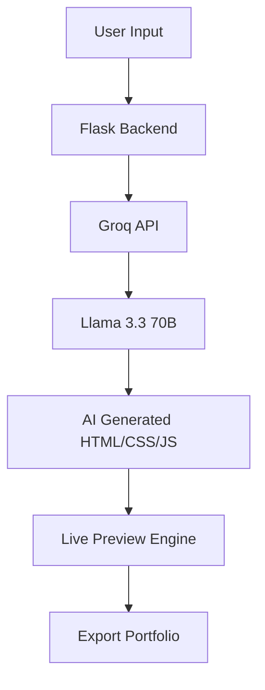

# 🚀 AI Portfolio Generator — Next-Gen Personal Branding Engine

<div align="center">

### ⚡ Generate Stunning Developer Portfolios in Seconds Using AI

Build sleek, responsive, modern portfolio websites powered by ultra-fast AI inference with **Groq + Llama 3.3 70B**.

<br>

[](https://www.python.org)
[](https://flask.palletsprojects.com/)
[](https://groq.com/)
[]()
[](LICENSE)

</div>

---

# ✨ Overview

**AI Portfolio Generator** is a futuristic web application that transforms simple professional details into a fully designed, production-ready portfolio website instantly.

Using the blazing speed of **Groq Cloud** and the intelligence of **Llama 3.3 70B**, the engine dynamically architects elegant layouts, responsive sections, typography systems, color palettes, and animations — all generated in real time.

No templates.
No drag & drop.
Just pure AI-driven frontend generation.

---

# 🌌 Features

## ⚡ Ultra-Fast AI Generation

Generate complete single-page portfolio websites in seconds using Groq’s ultra-low latency inference engine.

---

## 🎨 Dynamic Theme Engine

Customize your portfolio instantly using your own accent color system powered by CSS variables.

```css
:root {
  --accent: #00ff88;
}
```

---

## 👁️ Live Sandboxed Preview

Real-time rendering using secure `iframe srcdoc` injection for instant visual feedback without reloads.

---

## 💾 One-Click Export

Download a complete standalone `portfolio.html` file instantly or copy the generated source code directly.

---

## 🌍 Arabic + English Ready

Bi-directional layout support with optimized prompts for both RTL and LTR typography systems.

---

## 🌙 Futuristic UI/UX

Minimal cyberpunk aesthetic with:

* Glassmorphism
* Smooth hover effects
* Neon accents
* Responsive grid systems
* Modern typography hierarchy

---

# 🧠 AI Generation Pipeline



---

# 🛠️ Tech Stack

| Layer             | Technology                |
| ----------------- | ------------------------- |
| Backend           | Python + Flask            |
| AI Engine         | Groq Cloud                |
| LLM Model         | Llama-3.3-70B-Versatile   |
| Frontend          | HTML5 + CSS3 + Vanilla JS |
| API Communication | Fetch API                 |
| Styling System    | Custom CSS Variables      |
| Deployment        | Local / Cloud Ready       |

---

# 📂 Project Structure

```bash
portfolio-generator/
│
├── app.py
├── generator.py
├── requirements.txt
├── .env
│
├── templates/
│   └── index.html
│
└── static/
    ├── css/
    ├── js/
    └── assets/
```

---

# 🚀 Quick Start

## 1️⃣ Clone Repository

```bash
git clone https://github.com/your-username/portfolio-generator.git

cd portfolio-generator
```

---

## 2️⃣ Create Virtual Environment

### Windows

```bash
python -m venv venv
venv\Scripts\activate
```

### macOS / Linux

```bash
python3 -m venv venv
source venv/bin/activate
```

---

## 3️⃣ Install Dependencies

```bash
pip install -r requirements.txt
```

---

## 4️⃣ Configure Environment Variables

Create a `.env` file:

```env
GROQ_API_KEY=gsk_your_secret_key_here
```

---

## 5️⃣ Run Application

### Windows PowerShell

```powershell
$env:PYTHONIOENCODING="utf-8"
python app.py
```

### macOS / Linux

```bash
python app.py
```

---

# 🌐 Open in Browser

```bash
http://127.0.0.1:5000
```

---

# 🦾 Prompt Engineering Architecture

The system prompt is engineered to force the model into acting like a **frontend compiler** instead of a chatbot.

### Core Constraints

✔ Fully encapsulated CSS inside `<style>`
✔ Fully responsive layouts
✔ Dark futuristic theme only
✔ Smooth animations & transitions
✔ Structured semantic sections
✔ No markdown wrappers
✔ Clean iframe-ready output

---

# 🔥 Example Generated Sections

* Hero Landing
* About Me
* Skills Matrix
* Experience Timeline
* Projects Showcase
* Contact System
* Social Links
* Footer Signature

---

# 📸 Preview

```html
<section class="hero">
    <h1>John Doe</h1>
    <p>AI Engineer • Full Stack Developer • UI Architect</p>
</section>
```

---

# 🛡️ Security Design

* API keys isolated using `.env`
* Sandboxed iframe rendering
* No direct execution of user scripts
* Lightweight architecture with minimal attack surface

---

# 📈 Future Roadmap

* [ ] Multi-page portfolio generation
* [ ] Resume PDF export
* [ ] TailwindCSS generation mode
* [ ] Portfolio hosting integration
* [ ] AI image generation
* [ ] GitHub auto-sync
* [ ] Drag-and-drop editing layer

---

# 🤝 Contributing

Contributions are welcome.

```bash
fork → clone → commit → push → pull request
```

---

# 📜 License

Distributed under the **MIT License**.

---

<div align="center">

# ⚡ Built For Developers Who Want To Ship Fast

### Generate. Preview. Export. Deploy.

</div>
